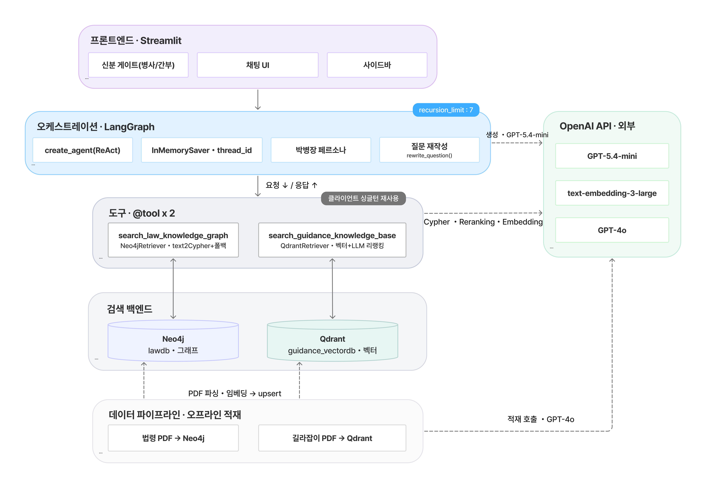
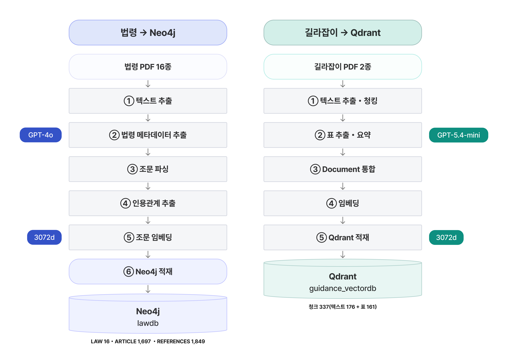
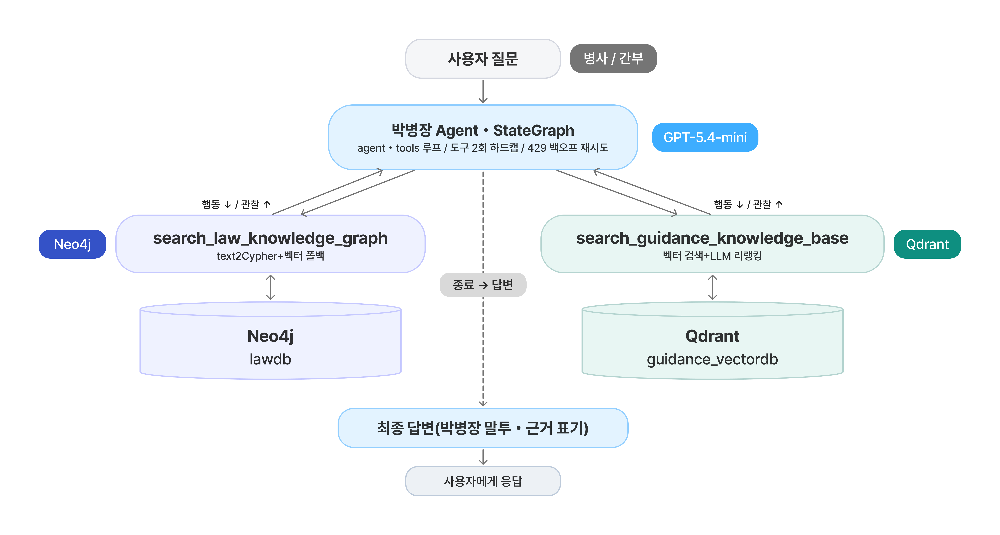

# SKN31-3rd-2Team

## 1. 팀 및 팀원 소개

### • 팀명 : 진격의 박병장

| 박동관 | 고현아 | 김세희 | 이용혁 | 전서연 |
| :---: | :---: | :---: | :---: | :---: |
| <a href="https://github.com/Parkdongkwan"> | <a href="https://github.com/hellene0708-cyber"> | <a href="https://github.com/kimsehuikim"> | <a href="https://github.com/leeyonghyok"> |  <a href="https://github.com/sxoxyn"> |
| |  |  |  |  |
| <b>PM/BE</b>     |<b>FE</b>  |<b>BE</b>   |<b>BE</b>  | <b>BE/FE</b>   | | 

## 1.2 WBS

| Phase | Task | Owner |
|:---:|:---|:---:|
| 🟢 | 주제 선정 | 박동관 |
| 🟢 | 데이터 확보 및 청킹 | 박동관, 이용혁 |
| 🔵 | Neo4j · Qdrant Retriever 구현 | 박동관 |
| 🔵 | 메모리(단기기억) 및 페르소나 구현 | 김세희, 박동관 |
| 🔵 | 그래프 구조 및 라우팅 개선 | 전서연, 박동관, 김세희 |
| 🔵 | UI (streamlit) 및 백엔드 연동 | 고현아, 전서연 |
| 🟣 | 모델 평가 | 이용혁, 박동관 |
| 🟣 | README 작성 | 김세희, 전서연 |
| 🟣 | 산출물 작성 | 전서연, 김세희 |
| 🟣 | 발표 준비 | 박동관, 김세희 |

---

## 2. 프로젝트 개요
## 2.1 프로젝트 소개
병영생활과 군 관련 규정 정보를 쉽고 정확하게 제공하기 위한 AI 기반 RAG(Retrieval-Augmented Generation) 챗봇입니다.   
군 관련 정보는 법령, 행정규칙, 병영생활 길라잡이 등 여러 문서에 분산되어 있고, 기존 키워드 검색은 정확한 용어를 입력해야 하는 한계가 있습니다.   
이를 해결하기 위해 Neo4j와 Qdrant를 활용한 하이브리드 검색을 적용하여 사용자 질문에 적합한 정보를 검색하고, LLM을 기반으로 신뢰도 높은 답변을 제공합니다.
> - **Neo4j**를 활용하여 법률 및 규정의 관계를 기반으로 정확한 정보를 적재 및 검색
> - **Qdrant**를 활용하여 병영생활 길라잡이 문서를 의미 기반(Vector Search)으로 적재 및 검색
> - **LangGraph** 기반 워크플로우를 통해 검색 → 자료 참조 → 답변 생성 과정을 체계적으로 구성
> - 검색된 문서를 기반으로 LLM이 신뢰도 높은 답변을 생성
> - **단기기억** 과 RAG를 결합하여 대화 맥락과 검색 결과를 함께 반영
검색된 문서를 기반으로 LLM이 신뢰도 높은 답변을 생성


## 2.2 프로젝트 배경
군 장병들은 복무 중 궁금한 사항이 생겨도 선임이나 간부에게 먼저 물어보거나 여러 규정 문서를 직접 찾아봐야 하는 경우가 많습니다.   
하지만 관련 정보는 법령, 행정규칙, 병영생활 길라잡이 등 여러 문서에 분산되어 있고, 법률 문서는 전문 용어와 조문 중심으로 작성되어 원하는 답을 찾는 데 많은 시간과 어려움이 따릅니다.   
이에 장병들이 누구에게 묻지 않아도 자연어 질문만으로 필요한 정보를 쉽고 정확하게 확인할 수 있는 AI 기반 하이브리드 RAG 챗봇을 개발하게 되었습니다.

## 2.3 주요 기능 
☑️ **자연어 기반 질의응답**  
  : 사용자의 질문 의도를 파악해 자연스러운 답변을 제공합니다.

☑️  **법률·규정 검색**  
  : Neo4j를 활용해 군 관련 법령과 규정을 관계 기반으로 검색합니다.

☑️  **병영생활 안내 검색**  
  : Qdrant를 활용해 길라잡이 문서를 의미 기반으로 검색합니다.

☑️  **하이브리드 RAG**  
  : Neo4j와 Qdrant의 검색 결과를 결합해 신뢰도 높은 답변을 생성합니다.

## 2.4  기술 스택

| Layer | Technology |
|:---|:---|
| Language |  |
| Frontend |  |
| AI / Evaluation |     |
| Database |   |
| Libraries |   


---

## 3. 프로젝트 구조

```text
SKN31-3RD-2TEAM/ 📁
│
├── app/
│   ├── streamlit/
│   ├── services/                  # UI ↔ Backend 연동 서비스
|   │     └── api_client.py
│   ├── state/                     # 대화 상태 및 세션 관리
│   ├── ui/                        # 채팅 화면 및 UI 컴포넌트
│   └── app.py                     # Streamlit 메인 실행 파일
│
├── backend/
│   ├── graphdb_retriever.py       # Neo4j 기반 법령 Retriever
│   ├── run_chatbot.py             # create_agent 기반 RAG Agent
│   ├── tools.py                   # LangChain Tool 정의
│   └── vectordb_retriever.py      # Qdrant 기반 문서 Retriever
│
├── data/                          # 원본 PDF 및 데이터
│
├── datasetLoaderScript/
│   ├── guidance_loader.ipynb      # 병영생활 길라잡이 → Qdrant 적재
│   └── law_pdfs_to_neo4j_pipeline.ipynb
│                                  # 법령 PDF → Neo4j 그래프 구축
│
├── evaluation/
│   ├── rag_evaluation.ipynb       # RAG 성능 평가
│   └── rag_testset.csv            # 평가 데이터셋
│
├── image/                         # README 이미지
│
├── .env                           # 환경 변수
├── .gitignore                     # Git 제외 파일 설정
├── Execute.bat                    # 프로젝트 실행 스크립트
└── README.md                      # 프로젝트 설명
```
---

## 4. 시스템 아키텍처

• [⌜시스템 아키텍처⌟](산출물/시스템_아키텍처.md)에서 자세히 보기


---

## 5. 데이터 파이프라인

• [⌜데이터 수집 및 전처리⌟](산출물/데이터_수집_및_전처리.md)에서 자세히 보기


---

## 6. 실행 파이프라인


---

## 7. RAG 평가
• [⌜RAG 평가⌟](산출물/RAG_평가.md)에서 자세히 보기

---

## 8. 설치

```bash
cd psych_med_chatbot

python -m venv .venv

.\.venv\Scripts\activate

pip install -r requirements.txt
```

가상환경이 생성되면 프로젝트 루트에 **`.venv`** 폴더가 생성됩니다.

필요한 패키지는 `requirements.txt`를 통해 한 번에 설치됩니다.

설치가 완료되면 프로젝트 루트에 있는 **`.venv`** 가상환경을 사용하여 애플리케이션을 실행합니다.

---

### 실행 (Windows)

아래 내용을 `run.bat` 파일로 저장한 후 실행하면 Streamlit이 자동으로 실행됩니다.

```bat
@echo off

:: 1. 배치 파일이 있는 프로젝트 최상위 폴더로 이동
cd /d "%~dp0"

:: 2. 프로젝트의 가상환경(.venv)을 사용하여 Streamlit 실행
.\.venv\Scripts\python.exe -m streamlit run app/app.py

pause
```

또는 터미널에서 직접 아래 명령어를 실행해도 됩니다.

```bash
.\.venv\Scripts\python.exe -m streamlit run app/app.py
```

> **참고**
>
> - 반드시 프로젝트 루트에 **`.venv`** 가상환경이 생성되어 있어야 합니다.
> - [⌜requirements.txt 바로가기⌟](requirements.txt) 설치가 완료되지 않은 경우 실행 시 오류가 발생할 수 있습니다. 
> 
> - 애플리케이션이 정상 실행되면 브라우저에서 Streamlit 페이지가 자동으로 열립니다. 

## 8.1 Data Indexing

### Neo4j

```bash
code law_pdfs_to_neo4j_pipeline.ipynb
```

모든 셀을 순서대로 실행하여 Neo4j에 데이터를 적재합니다.

### Qdrant

```bash
code guidance_loader.ipynb
```

모든 셀을 순서대로 실행하여 Qdrant에 데이터를 적재합니다.

---

## 9. 회고
#### 박동관
 - 이번 프로젝트를 통해 군 법령 데이터와 군생활 팁 데이터를 수집하고, 데이터의 특성에 맞게 청킹하는 과정을 수행하였다. 또한 각 데이터의 특성을 고려하여 구조적 관계를 활용하는 정보는 Neo4j에, 의미 기반 검색에 적합한 정보는 Qdrant에 저장하는 RAG 파이프라인을 직접 구축해 볼 수 있었다.
이후 각 데이터베이스를 참조하여 필요한 정보를 검색하는 Retriever를 구현하고, 이를 Tool 형태로 변환하여 Agent와 연동함으로써 LLM 기반 챗봇의 전체 동작 흐름을 설계하고 구현하는 경험을 쌓았다. 단순히 RAG를 사용하는 것에 그치지 않고, 데이터 저장부터 검색, Tool 연동, Agent 기반 응답 생성까지 전체 파이프라인을 직접 구성해 보면서 RAG 시스템의 구조와 동작 원리를 깊이 이해할 수 있었던 의미 있는 프로젝트였다.

#### 고현아
  - 이번 프로젝트에서 늘 다루던 백엔드를 벗어나 처음으로 프론트엔드(Streamlit)를 온전히 전담하게 되었습니다.
초기 디자인 기획부터 화면 구현까지 백지상태에서 시작하다 보니 막막함도 있었지만, 팀원들의 다양한 의견을 수용하고 그것을 실제 화면에 즉각적으로 적용해 나가는 과정이  새로웠습니다.  특히 개발 도중 백엔드의 로직이나 구조가 변경될 때마다, 프론트엔드 역시 그에 맞춰 유기적으로 코드를 수정하고 대응해야 하는 과정이 결코 쉽지 않았지만  수많은 시행착오를 끈질기게 해결하며 마침내 성공적으로 결과물을 완성해 냈을 때 잊지 못할 큰 성취감을 느꼈습니다.
다음 홈페이지 구축을 앞두고 프론트엔드 설계와 흐름을 미리 체득한 덕분에, 앞으로의 프로젝트도 성공적으로 이끌 수 있다는 확신을 얻은 값진 경험이었습니다. 

#### 김세희
 - 이번 프로젝트에서는 각 코드가 어떤 역할을 하는지 하나씩 분석하며 사용자의 질문이 Neo4j와 Qdrant를 거쳐 최종 답변으로 이어지는 전체 흐름을 이해할 수 있었습니다. 특히 제가 맡은 단기기억과 페르소나 기능을 구현하면서 챗봇이 이전 대화를 기억하고 사용자에 맞게 응답하는 원리를 직접 경험할 수 있어 의미 있는 시간이었습니다. 또한 데이터의 특성에 맞는 도구를 선택하는 과정의 중요성을 체감했고, README를 작성하며 다른 사람도 프로젝트를 쉽게 이해하고 사용할 수 있도록 문서를 정리하는 것 역시 개발 과정의 중요한 부분이라는 점을 배웠습니다.  GitHub 협업 과정에서 발생한 다양한 오류를 해결하며 프로젝트를 실행하고 관리하는 경험도 쌓을 수 있었습니다. 이전 프로젝트보다 코드의 구조와 동작 원리를 더 깊이 이해하게 되었고, 문제를 해결하는 과정에서 새로운 기술과 역할에도 한층 자신감을 가지고 도전할 수 있게 되었습니다.
#### 이용혁
 - 프로젝트 모델의 평가를 담당했습니다. 사용한 데이터베이스가 두 종류(Qdrant, Neo4J)라서 평가에 어려움이 있었습니다. 팀장을 비롯한 팀원들과의 협의를 통해 각각의 DB에서 추출한 질문을 통합해 프로젝트 모델을 평가하였습니다. 시간과 능력이 부족하였지만 팀원들의 지원과 격려속에 무사히 마칠 수있어 다행이었습니다.

#### 전서연
 - 이번 프로젝트에서는 백엔드와 프론트엔드를 오가며 작업을 진행했습니다. 백엔드에서는 그래프의 구조를 강화했고, 이후 create_agent를 도입해 파이프라인을 자동화로 전환했습니다. UI/UX 쪽에서는 컴포넌트 구성과 전체적인 색감을 손보며 완성도를 높였습니다.  원래 프론트엔드 위주로 작업해왔는데, 이번에 백엔드 구조를 직접 설계하고 리팩토링해볼 기회가 있어서 좋았습니다. 특히 그래프 기반 파이프라인을 손으로 짜다가 자동화된 구조로 넘어가는 과정에서 설계 방식의 차이를 체감할 수 있었던 점이 인상 깊었습니다. 열정가득 불도저 같은 팀장님의 지시 아래 각자의 자리에서 열심히 하는 팀원들을 보며 자극을 받았고, 좋은 결과물을 낼 수 있던 것 같아 만족스럽습니다.😄
