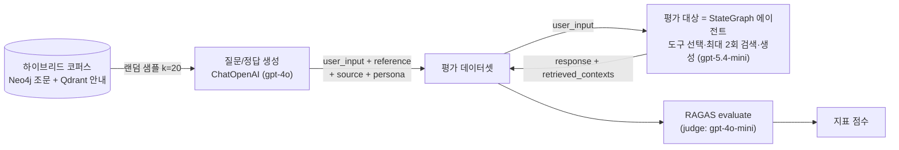
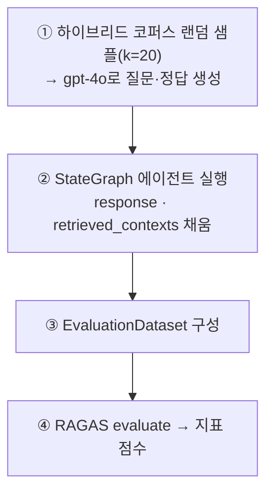

# RAG 평가 (RAGAS)
## 군 법률·규정 RAG 챗봇 · 박병장

박병장의 설계 원칙은 "LLM이 법적 판단을 지어내지 않고, 검증된 조문·안내를 검색해 인용한다"이다. 이 원칙이 실제로 지켜지는지 — **맞는 근거를 찾아오는가(검색)**, **찾아온 근거에 충실하게 답하는가(생성)** — 를 수치로 확인하는 것이 이 평가의 목적이다.

평가는 챗봇이 실제로 검색하는 두 소스(Neo4j 조문 · Qdrant 생활 안내)를 **하나의 하이브리드 코퍼스로 합쳐** 측정하되, 각 평가 문항에 `source`(neo4j/qdrant)를 태깅해 소스별로 분해해 볼 수 있게 한다. 챗봇이 두 소스를 함께 검색하는 구조이므로, 평가의 단위 역시 두 소스를 함께 쓰는 실사용 시스템으로 두는 것이 현실을 대표한다.

> **평가 대상 범위** — 이 평가는 운영과 동일한 **StateGraph 에이전트 전체**를 대상으로 한다. `LangGraphChatbot.ask()` 는 `agent → tools` 노드로 구성된 그래프를 실행하므로, 이 점수에는 **도구 선택·최대 2회의 (재)검색·답변 생성** 이 모두 포함된다. 즉 개별 retriever 체인이 아니라 오케스트레이션까지 통과한 종단(end-to-end) 성능을 본다.

---

## 1. 평가 개요와 원칙

**오프라인·정량 평가를 기본으로 한다.**
미리 만든 합성 테스트셋으로 자동 지표(RAGAS)를 측정한다. 실사용 트래픽 기반 온라인 평가나 사람이 직접 채점하는 정성 평가는 이 문서 범위 밖이며, 필요 시 별도로 보완한다.

**검색과 생성을 나눠 본다.**
"관련 문서를 잘 찾아왔는가"(검색)와 "찾아온 문서에 근거해 잘 답했는가"(생성)는 다른 문제다. RAGAS의 검색 지표 2종·생성 지표 2종으로 두 단계를 분리 측정한다.

**할루시네이션(faithfulness)을 핵심 지표로 둔다.**
박병장은 법적 판단을 생성하지 않고 인용하는 것이 원칙이므로, "답변이 검색된 근거에서 벗어나지 않았는가"가 이 프로젝트에서 가장 중요한 항목이다.

**리랭킹의 효과를 전후 비교로 측정한다.**
Qdrant 길라잡이 검색기에 LLM 기반 리랭커를 도입한 것이 이번 평가의 핵심 개선이다. 리랭킹 적용 전과 후의 지표를 같은 테스트셋으로 비교해 개선 효과를 확인한다([5장](#5-평가-결과)).

**적재·질의의 임베딩 모델을 일치시킨다.**
검색 경로의 임베딩은 `text-embedding-3-large`(3072-dim)로 통일한다. 적재 시점과 검색 시점의 벡터 공간이 어긋나면 검색이 무너지기 때문이다.

---

## 2. 평가 지표 (RAGAS)

RAGAS는 RAG 파이프라인을 정량 평가하는 오픈소스 프레임워크다. 채점에는 judge LLM(`gpt-4o-mini`)과 임베딩을 쓰며, 아래 4개 지표를 사용한다.

| 단계 | 지표 (RAGAS 클래스) | 무엇을 보는가 | 점수 |
|---|---|---|---|
| 검색 | **Context Precision** (`ContextPrecision`) | 검색된 컨텍스트 중 정답(reference)과 관련된 것이 얼마나 상위에·집중적으로 오는가 | 0~1 (↑) |
| 검색 | **Context Recall** (`ContextRecall`) | 정답(reference)에 필요한 정보가 검색 결과에 얼마나 포함됐는가 | 0~1 (↑) |
| 생성 | **Faithfulness** (`Faithfulness`) | 답변의 주장들이 검색 문맥에서 추론 가능한가 (할루시네이션 반대) | 0~1 (↑) |
| 생성 | **Answer Relevancy** (`AnswerRelevancy`) | 답변이 질문에 얼마나 부합하는가 | 0~1 (↑) |

- **Context Precision / Recall 은 `reference`(정답)를 기준으로** 검색 결과를 대조한다. "검색이 정답에 필요한 근거를 상위에·충분히 가져왔는가"를 본다.
- **Answer Relevancy 는 임베딩을 사용**해 질문과 답변의 부합도를 측정하므로, RAGAS 평가에 임베딩이 필요하다.
- 각 지표의 산정 방식(주장 추출·문맥 대조·질문 역생성 등)은 노트북에 정리돼 있어 여기서는 생략한다.

---

## 3. 평가 파이프라인

**(1) 합성 테스트셋 생성**
하이브리드 코퍼스에서 문서 `TESTSET_SIZE`(=20)개를 무작위로 뽑고, 각 문서를 **유일한 근거(context)** 로 삼아 `ChatOpenAI`(gpt-4o)를 한 번씩 호출해 **질문(`user_input`)과 정답(`reference`)** 을 생성한다. 페르소나를 번갈아 넣어(군 복무자 ↔ 법령 확인 민원인) 실제 사용자가 물어볼 법한 질문을 유도한다. 문서가 이미 청크/조문 단위이므로 추가 분할은 하지 않는다. (테스트셋 생성은 RAGAS `TestsetGenerator` 가 아니라 자체 LLM 생성이며, 채점만 RAGAS를 쓴다.)

| 항목 | 값 |
|---|---|
| 생성 LLM | `gpt-4o` (temperature 0.7) |
| 생성 단위 | 문서 1개당 질문 1 + 정답 1 |
| 근거(context) | 해당 문서 본문 → `reference_contexts` |
| 태깅 | `source`(neo4j/qdrant), `persona` |
| 출력 | `rag_testset.csv` (컬럼: `user_input · reference · reference_contexts · source · persona`) |

**(2) 평가 대상 에이전트 실행**
생성된 각 `user_input`을 `LangGraphChatbot.ask()`에 넣어 **답변(`response`)** 과 **실제 검색 결과(`retrieved_contexts`)** 를 채운다. 에이전트(StateGraph)가 질문 성격에 따라 도구를 스스로 선택하며, 필요하면 최대 2회까지 (재)검색한다. 여기서 `retrieved_contexts`(에이전트가 런타임에 검색해 온 것)는 `reference_contexts`(테스트셋 생성 근거)와 구분되며, 검색 지표는 이 둘의 관계를 채점한다.

**(3) RAGAS 채점**
`user_input` / `retrieved_contexts` / `response` / `reference` 4개 컬럼으로 `EvaluationDataset`을 만들고 `evaluate()`로 4개 지표를 채점한다.

| 항목 | 값 |
|---|---|
| 채점(judge) LLM | `gpt-4o-mini` (temperature 0) |
| 채점 임베딩 | `OpenAIEmbeddings` (Answer Relevancy용) |
| 지표 | `Faithfulness`, `AnswerRelevancy`, `ContextPrecision`, `ContextRecall` |
| 출력 | 문항별 점수 CSV + 지표별 평균 |

---

## 4. 평가 대상 시스템

**에이전트 (`run_chatbot.py` · StateGraph)**
`agent`(LLM 판단) → `tools`(검색 실행) 노드로 구성된 명시적 그래프다. 도구 선택·재검색 여부·답변 생성은 모두 시스템 프롬프트를 따르는 LLM이 판단하고, 코드가 강제하는 것은 **도구 호출 최대 2회 하드캡**뿐이다. 명확한 질문은 도구 하나로 끝내고, 보수·휴가·교육처럼 **법적 근거와 실무 절차가 함께 필요한 교차 주제**이거나 첫 검색이 부족할 때만 다른 도구를 순차적으로 한 번 더 호출한다. 모델은 `gpt-5.4-mini`, 단기 메모리는 `InMemorySaver`(thread_id)로 유지한다.

**법령 도구 — `search_law_knowledge_graph` (Neo4j)**
text-to-Cypher로 조문을 조회하고, 실패(생성 오류·안전하지 않은 Cypher·실행 오류·0건)하면 벡터 검색(`article_vector_index`)으로 폴백한다. 폴백은 코사인 유사도 임계값(0.75)을 넘는 문서만 채택하고, 없으면 최상위 1개만 반환해 무관한 조문이 섞이는 것을 막는다. CUD 계열 금지어(`CREATE`·`DELETE`·`SET`·`MERGE` 등)를 차단하는 안전장치가 있다.

**길라잡이 도구 — `search_guidance_knowledge_base` (Qdrant) · 이번 리랭킹의 대상**
벡터 검색으로 넉넉히 15개를 확보한 뒤(recall 확보), LLM 리랭커가 15개 전부에 질문 관련도를 0~10점으로 매기고, 임계값(6.0)을 넘는 문서만 채택한다(넘는 문서가 없으면 최상위 1개). 문서를 "포함/배제"하지 않고 전부 점수화한 뒤 컷하므로, 정답 문서가 잘려 나가 recall이 깨지거나 노이즈가 백필되어 precision이 떨어지는 문제를 구조적으로 피한다. **이 리랭커의 적용 전/후가 5장 결과의 비교 대상이다.**

---

## 5. 평가 결과

> 합성 테스트셋 20개(`gpt-4o` 생성)에 대해, RAGAS 4개 지표로 채점한 결과다.
> **리랭킹(Qdrant LLM 리랭커) 적용 전과 후**를 같은 테스트셋으로 비교한다.
> 랜덤 샘플이므로 실행마다 값이 달라질 수 있어, 시드 고정 또는 수회 평균을 권한다.

### 5.1 리랭킹 전후 비교 (n=20)

| 지표 | 리랭킹 전 | 리랭킹 후 (최종) | 변화 |
|---|---|---|---|
| **Context Precision** | 0.4350 | **0.8000** | ▲ +0.3650 |
| **Context Recall** | 0.4550 | **0.6500** | ▲ +0.1950 |
| **Faithfulness** | 0.7800 | **0.7803** | ≈ +0.0003 |
| **Answer Relevancy** | 0.8600 | **0.5348** | ▼ −0.3252 |

**검색은 크게 개선됐으나, 생성 지표는 엇갈렸다.** 리랭커가 직접 겨냥한 검색 정밀도(Context Precision)가 +0.3650으로 가장 크게 올랐고(0.4350→0.8000), 재현율(Context Recall)도 +0.1950 상승했다(0.4550→0.6500). 노이즈가 걷히며 검색 병목이 완화된 것이다. 반면 생성 쪽은 근거 충실성(Faithfulness)이 0.7800→0.7803으로 사실상 정체했고, 질문 적합도(Answer Relevancy)는 0.8600→0.5348로 오히려 **크게 하락**했다. 검색 정밀도를 끌어올린 대가로 답변 적합도를 잃은 트레이드오프가 나타난 것이다(원인은 [6장](#6-해석과-개선) 참조).

---

## 6. 해석과 개선

**리랭킹은 검색 병목을 완화했으나, 답변 적합도를 떨어뜨렸다.**
리랭킹 전에는 Context Precision·Recall이 0.43~0.46으로 낮아 검색이 병목이었다. LLM 리랭커 도입 후 Precision은 0.80, Recall은 0.65로 올라 "관련 문서가 상위에 오지 못하거나 충분히 담기지 못하던" 문제가 크게 개선됐다. 그러나 생성 지표는 함께 오르지 않았다. Faithfulness는 0.7800→0.7803으로 정체했고, Answer Relevancy는 0.8600→0.5348로 급락했다. 검색 정밀도와 답변 적합도가 정반대로 갈렸다는 것은, 리랭커의 임계값(6.0)이 **과하게 필터링**하여 답변에 필요한 맥락까지 잘려 나갔음을 시사한다. 컨텍스트가 과도하게 줄면 LLM이 질문에 온전히 답할 재료가 부족해져, 검색 정밀도는 올라도 답변 품질(적합도)은 무너진다.

**남은 개선 여지.**
- **최우선 — Answer Relevancy 회복.** 지금은 정밀도를 위해 답변 적합도를 희생한 상태다. 리랭커 임계값(6.0)을 낮추거나(예: 4~5), 임계값을 넘는 문서가 없을 때의 `fallback_k`(현재 1)를 키워 **최소 컨텍스트를 보장**하면, 정밀도를 크게 잃지 않으면서 답변 재료 부족을 완화할 수 있다. 조정 전후로 Precision과 Answer Relevancy를 함께 보며 균형점을 찾는다.
- **Faithfulness 정체 점검.** 검색이 깨끗해졌는데도 근거 충실성이 그대로다. 컨텍스트가 지나치게 줄어 답변이 근거를 충분히 활용하지 못하는지, 생성 프롬프트가 근거를 제대로 녹여내는지 함께 확인한다.
- **Recall은 더 끌어올릴 여지.** Qdrant 쪽은 청킹 크기·`search_limit` 조정으로, 법령(Neo4j) 쪽은 text-to-Cypher 정확도·폴백 임계값 조정으로 개선할 수 있다.
- **리랭킹은 현재 Qdrant 경로에만 있다.** 법령(Neo4j) 검색에도 동일한 관련도 리랭킹을 적용하면 법령 문항의 검색 정밀도를 개선할 수 있다.

### 향후 과제
- **인용 정확도 지표 추가**: 답변에 표기된 조문번호·문서명이 실제 `retrieved_contexts`와 일치하는지 확인하는 프로젝트 고유 지표. RAGAS 기본 4종에는 없으나 박병장의 핵심 원칙과 직결된다.
- **도구 라우팅 정확도 지표**: 문항의 `source`(정답 소스)와 에이전트가 실제 호출한 도구를 대조해 라우팅 정확도를 산출하고, 교차 주제에서 두 도구를 함께 부른 경우 그 효과를 측정한다.
- **신분별(병/간부) 페르소나 평가**: 경어/반말 일관성 등은 RAGAS 밖의 별도 정성 평가로.
