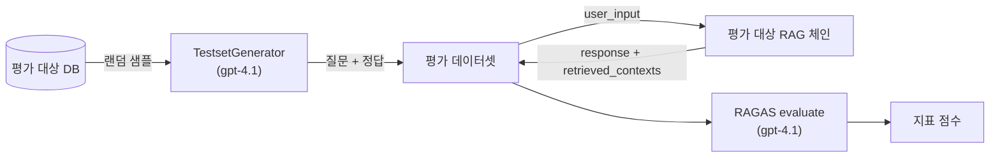
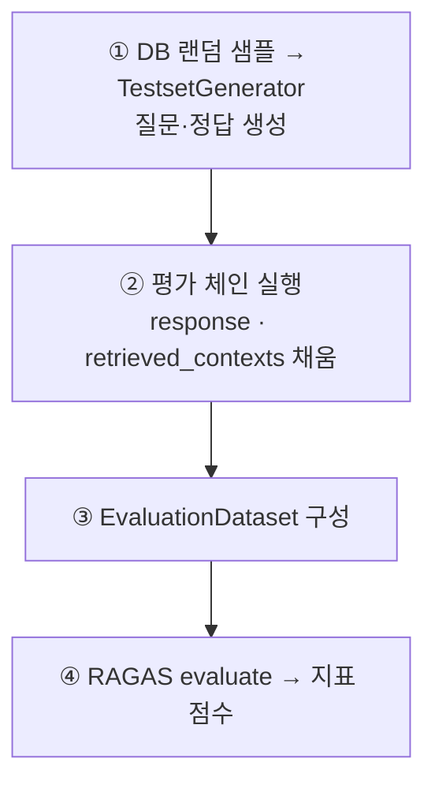

# RAG 평가 (RAGAS)
## 군 법률·규정 RAG 챗봇 · 박병장

박병장의 설계 원칙은 "LLM이 법적 판단을 지어내지 않고, 검증된 조문·안내를 검색해 인용한다"이다. 이 원칙이 실제로 지켜지는지 — **맞는 근거를 찾아오는가(검색)**, **찾아온 근거에 충실하게 답하는가(생성)** — 를 수치로 확인하는 것이 이 평가의 목적이다.

평가는 두 검색 소스(Neo4j 조문 · Qdrant 생활 안내)를 **각각 독립적으로** 측정한다. 두 소스는 담는 내용·검색 방식이 달라, 하나로 합쳐 채점하면 어느 쪽이 병목인지 드러나지 않기 때문이다.

> **평가 대상 범위** — 이 평가는 각 소스의 **retriever + 생성 체인**(검색 → 컨텍스트 조립 → LLM 답변)을 대상으로 한다. 런타임의 `create_agent` 전체(도구 선택·재호출 등 오케스트레이션)가 아니라, 그 안에서 각 도구가 담당하는 검색·생성 품질을 분리해 본다. (오케스트레이션 자체 평가는 [향후 과제](#5-해석과-개선)로 둔다.)

---

## 1. 평가 개요와 원칙

**오프라인·정량 평가를 기본으로 한다.**
미리 만든 합성 테스트셋으로 자동 지표(RAGAS)를 측정한다. 실사용 트래픽 기반 온라인 평가나 사람이 직접 채점하는 정성 평가는 이 문서 범위 밖이며, 필요 시 별도로 보완한다.

**검색과 생성을 나눠 본다.**
"관련 문서를 잘 찾아왔는가"(검색)와 "찾아온 문서에 근거해 잘 답했는가"(생성)는 다른 문제다. RAGAS의 검색 지표 2종·생성 지표 2종으로 두 단계를 분리 측정한다.

**할루시네이션(faithfulness)을 핵심 지표로 둔다.**
박병장은 법적 판단을 생성하지 않고 인용하는 것이 원칙이므로, "답변이 검색된 근거에서 벗어나지 않았는가"가 이 프로젝트에서 가장 중요한 항목이다.

**적재·질의·평가의 임베딩 모델을 일치시킨다.**
`text-embedding-3-large`(3072-dim)로 통일한다. 적재 시점과 검색 시점이 다르면 벡터 공간이 어긋나므로, 평가용 임베딩도 같은 모델을 쓴다.

---

## 2. 평가 지표 (RAGAS)

RAGAS는 RAG 파이프라인을 정량 평가하는 오픈소스 프레임워크다(`pip install ragas rapidfuzz`). 아래 4개 지표를 사용한다.

| 단계 | 지표 (RAGAS 클래스) | 무엇을 보는가 | 점수 |
|---|---|---|---|
| 검색 | **Context Precision** (`LLMContextPrecisionWithReference`) | 검색된 문서 중 관련 있는 것이 얼마나 상위에 오는가 | 0~1 (↑) |
| 검색 | **Context Recall** (`LLMContextRecall`) | 정답에 필요한 정보가 검색 결과에 얼마나 포함됐는가 | 0~1 (↑) |
| 생성 | **Faithfulness** (`Faithfulness`) | 답변의 주장들이 검색 문맥에서 추론 가능한가 (할루시네이션 반대) | 0~1 (↑) |
| 생성 | **Answer Relevancy** (`AnswerRelevancy`) | 답변이 질문에 얼마나 부합하는가 | -1~1 (↑) |

각 지표의 산정 방식(주장 추출·문맥 대조·질문 역생성 등)은 노트북 2장에 정리돼 있어 여기서는 생략한다.

---

## 3. 평가 파이프라인

두 소스 모두 아래 동일한 흐름을 따른다. 다른 것은 [소스별 설정](#4-평가-대상별-설정)뿐이다.

**(1) 합성 테스트셋 생성**
평가 대상 DB에서 문서를 랜덤 샘플링(k=5)하고, `TestsetGenerator`로 **질문(`user_input`)과 정답(`reference`)**을 생성한다.

| 항목 | 값 |
|---|---|
| 생성 LLM | `gpt-4.1` (`TestsetGenerator`는 gpt-5 이후 모델 미지원) |
| 생성 임베딩 | `text-embedding-3-large` |
| 생성 방식 | `generate_with_chunks(docs, testset_size=10)` |
| 생성 지침 | 소스별 `llm_context`로 지정 (아래 4장) |

**(2) 평가 대상 RAG 체인 실행**
생성된 각 `user_input`을 평가 대상 체인에 넣어 **답변(`response`)**과 **검색 결과(`retrieved_contexts`)**를 채운다. 체인은 `retriever → 컨텍스트 조립 → 프롬프트 → LLM → 파서` 구조이며, 프롬프트는 "context에 근거가 없으면 '정보가 부족해 답을 할 수 없습니다'로 답하고 추측하지 말 것"을 명시한다.

**(3) RAGAS 채점**
`user_input` / `retrieved_contexts` / `response` / `reference` 4개 컬럼으로 `EvaluationDataset`을 만들고 `evaluate()`로 4개 지표를 채점한다.

| 항목 | 값 |
|---|---|
| 채점 LLM | `gpt-4.1` |
| 채점 임베딩 | `text-embedding-3-large` |
| 지표 | `LLMContextRecall`, `LLMContextPrecisionWithReference`, `Faithfulness`, `AnswerRelevancy` |

---

## 4. 평가 대상별 설정

| | **Neo4j 평가** (`RAG_evaluation_Neo4j.ipynb`) | **Qdrant 평가** (`RAG_evaluation_Qdrant_1.ipynb`) |
|---|---|---|
| 대상 DB | `lawdb` (법령 조문) | `guidance_vectordb` (생활 안내) |
| Retriever | text-to-Cypher + 벡터 폴백 | `as_retriever(k=5)` (벡터 유사도) |
| 샘플 추출 | `ARTICLE` 노드 `ORDER BY rand() LIMIT 5` | `scroll` 전량 → `random.sample(…, 5)` |
| 테스트셋 지침 | 군 법령 질문 — 조문번호·법령명 명시형 + 주제·상황형 혼합 | 현역병 복지 관련 질문 |
| 예시 질문 | "군인연금법 제8조는 무엇인가요?" | "병장의 월급은?" |
| 안전장치 | Cypher 금지어(`CREATE`·`DELETE`·`SET`·`MERGE` 등) 차단 | — |

---

## 5. 평가 결과

> TestsetGenerator를 통해 합성된 테스트셋 10개를 가지고 평가 진행
- 랜덤 샘플이므로 실행마다 값이 달라질 수 있음 → 시드 고정 또는 수회 평균 권장.

### 5.1 소스별 지표 점수

| 소스 | Context Precision | Context Recall | Faithfulness | Answer Relevancy |
|---|---|---|---|---|
| Neo4j (`lawdb`) | 0.7222 | 0.4700 | 0.4615 | 0.3212 |
| Qdrant (`guidance_vectordb`) | 0.3030 | 0.8667 | 0.8363 | 0.4737 | 

### 5.2 관찰 (정성 메모)

- 낮게 나온 지표와 그 원인으로 의심되는 케이스: _____
- "정보가 부족합니다"로 회피한 질문 수 / 사유: _____
- 검색은 맞았으나 생성이 어긋난(또는 그 반대) 사례: _____

---

## 6. 해석과 개선

- **지표별 해석**: 어느 단계(검색 vs 생성)가 병목인지 — 예) Recall은 높은데 Precision이 낮으면 관련 문서는 들어오나 순위가 밀림 → `top_k`·리랭킹 검토. Faithfulness가 낮으면 프롬프트의 근거 준수 지침 강화. _____
- **개선 실험 기록**: 청킹 크기, `top_k`, 프롬프트 변경 등 조정 전후 점수 비교표. _____

**향후 과제**
- **인용 정확도 지표 추가**: 답변에 표기된 조문번호·문서명이 실제 `retrieved_contexts`와 일치하는지 확인하는 프로젝트 고유 지표. RAGAS 기본 4종에는 없으나 박병장의 핵심 원칙과 직결된다.
- **오케스트레이션 평가**: `create_agent`가 질문을 올바른 도구로 보내는지(도구 라우팅 정확도), 재검색이 실제로 결과를 개선하는지 측정.
- **신분별(병/간부) 페르소나 평가**: 경어/반말 일관성 등은 RAGAS 밖의 별도 정성 평가로.

---

## 부록 · 확인이 필요한 지점

평가 노트북과 운영 시스템(`시스템_아키텍처.md`) 사이의 불일치로 짚어둘 점:

- **생성 모델 불일치.** 평가 체인의 LLM은 `gpt-5.4-mini`인데, 운영 시스템은 `gpt-4o`(아키텍처 문서 기준)다. 지금 점수는 운영 생성 모델을 그대로 반영하지 못하므로, **평가 체인 모델을 운영과 맞추는 것**을 권한다.
- **평가 대상 ≠ 운영 오케스트레이션.** 평가는 단순 LCEL 체인(retriever→프롬프트→LLM)을 대상으로 하고, 운영의 `create_agent`(도구 선택·재호출)는 포함하지 않는다. 검색·생성 품질 분리 측정에는 적절하나, 이 점수가 곧 에이전트 전체 성능은 아님을 명시해 둔다.

> 특히 첫 두 항목(컬렉션명·생성 모델)은 평가 결과의 대표성에 직접 영향을 주므로 우선 확인을 권한다.