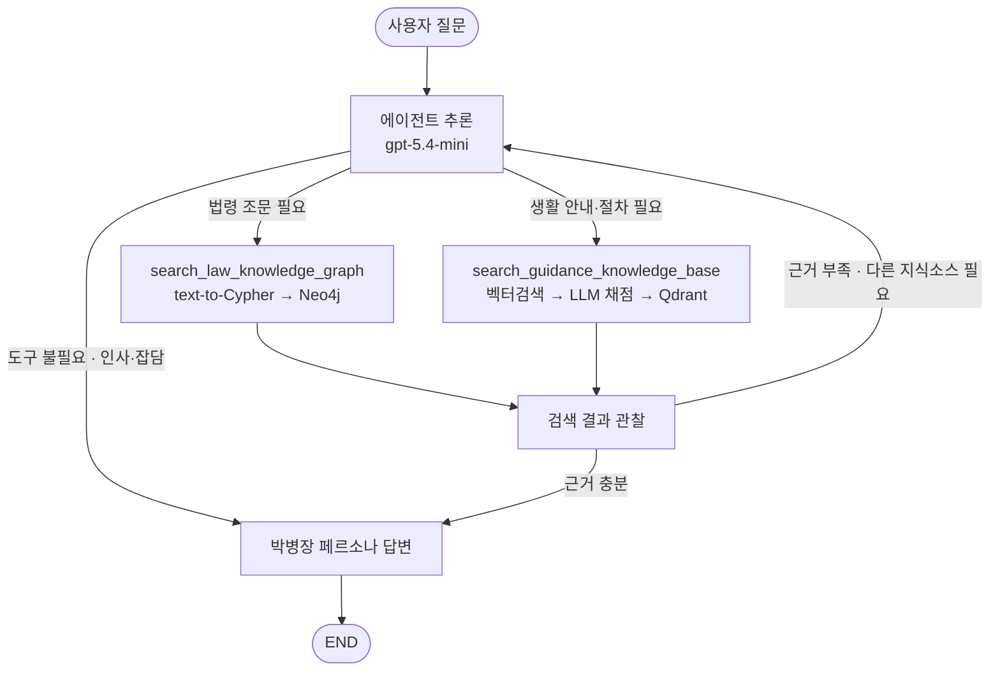

# 시스템 아키텍처 & 데이터베이스 설계
## 군 법률·규정 RAG 챗봇 '박병장'

### 개요

박병장은 군 법률·규정·실무 질문에 근거를 갖춘 답변을 제공하는 RAG 챗봇이다. 하나의 에이전트(`create_agent`)가 질문 성격에 따라 두 지식 소스 — 법령 조문을 담은 그래프 DB(Neo4j)와 실무 안내서를 담은 벡터 DB(Qdrant) — 중 필요한 쪽을 스스로 선택해 검색하고, 검색 결과를 바탕으로 박병장 페르소나로 답변을 생성한다.

이 문서는 시스템을 세 층위로 설명한다: 전체를 관통하는 **설계 원칙**, 지식을 담는 **두 데이터베이스**, 질문을 답변으로 바꾸는 **에이전트 오케스트레이션**.

---

## 1. 설계 원칙

- **도구를 갖춘 단일 에이전트**: `create_agent`로 만든 하나의 에이전트가 매 턴 스스로 판단한다. 규정 근거가 필요하면 도구를 호출하고, 인사·잡담이면 도구 없이 곧장 답한다. 검색 결과가 부족하면 질의를 바꾸거나 다른 도구를 다시 호출한다. 라우팅·재검색을 노드로 고정하지 않고 에이전트에게 맡겨 구조를 단순하게 유지한다.
- **지식 소스를 그래프와 벡터로 분리**: "무엇이 규정인가(법적 근거)"는 조문 그래프(Neo4j)로, "실제로 어떻게 하는가(절차·서식·표·수치)"는 PDF 벡터(Qdrant)로 답한다. 두 소스는 내용이 겹치지 않고 서로 보완한다.
- **두 DB를 독립된 도구로 노출**: Neo4j와 Qdrant 검색을 각각 `@tool` 함수(`search_law_knowledge_graph` / `search_guidance_knowledge_base`)로 따로 등록해, 에이전트가 필요에 따라 하나만 쓰거나 한 질문에 둘 다 호출할 수 있게 한다.
- **임베딩 모델 일치**: 두 DB 모두 적재·질의 시 동일하게 `text-embedding-3-large`(3072-dim, cosine)를 사용해 벡터 공간을 맞춘다.
- **검색 + 단기 기억만 유지**: 세션(`thread_id`) 동안의 대화 맥락만 유지하고, 장기 프로필/이력 저장소는 두지 않는다. 답변 근거는 매 질문 DB 검색으로 새로 확보해 최신성을 지킨다.
- **자원 재사용과 계층별 실패 흡수**: OpenAI/Qdrant 클라이언트와 Neo4j 드라이버는 모듈 임포트 시 한 번만 생성해 재사용한다. 각 검색 도구는 내부에서 발생하는 예외를 자체적으로 흡수해, 실패해도 에이전트 전체가 죽지 않고 안내 문자열을 반환하도록 설계했다.

---

## 2. 프로젝트 구조

백엔드 로직은 `backend` 패키지 하나로 묶여 있다.

```python
from backend.tools import search_law_knowledge_graph, search_guidance_knowledge_base
from backend.vectordb_retriever import QdrantRetriever
from backend.graphdb_retriever import Neo4jRetriever
```

이렇게 패키지화한 이유는 향후 API 서버 등 다른 컴포넌트와 통합할 때 백엔드 로직을 하나의 모듈로 임포트하기 위함이다. 실행 진입점(`run_chatbot.py`)은 항상 프로젝트 루트 기준 상대 경로에 있어야 한다.

---

## 3. 데이터베이스 설계

### 3.1 역할 분담

| | **Neo4j — GraphDB** | **Qdrant — VectorDB** |
|---|---|---|
| 담는 것 | 법령 조문(정형) + 조문 간 인용관계 | PDF 원문(본문·표, 비정형) |
| 강점 | 특정 법령·조문의 정확한 인용, 인용 조문 확장 | 절차·서식·표·수치, 원문 맥락 |
| 대표 질문 | "직권면직 사유는?", "공무원보수규정 제8조 알려줘" | "초급간부 휴가 신청 절차", "복지 포인트 지급표" |
| 검색 방식 | text-to-Cypher 생성 → 실패 시 벡터 폴백 | 벡터 검색(top-N) → LLM 전체 채점 → 임계값 컷 |

### 3.2 GraphDB — Neo4j (`lawdb`)

법령을 조문 노드로 쪼개고, 소속·인용 관계를 엣지로 잇는다. 조문 하나가 다른 조문을 인용하면 그 연결을 따라가 근거를 확장할 수 있는 것이 그래프를 쓰는 이유다.

**노드**

| 라벨 | 주요 속성 |
|---|---|
| `:LAW` | `id`(법령명), `name`, `law_type`(법률/대통령령/훈령 등), `effective_date` |
| `:ARTICLE` | `id`("법령명::제N조"), `law_id`, `name`(조문 제목), `description`(조문 본문), `original_id`(예: "제8조"), `embedding`(벡터 폴백용, 3072-dim) |

**관계**: `(:LAW)-[:CONTAINS]->(:ARTICLE)` (법령이 조문을 포함), `(:ARTICLE)-[:REFERENCE]->(:ARTICLE)` (조문이 다른 조문을 인용). 벡터 인덱스는 `article_vector_index`(`:ARTICLE.embedding`, 3072-dim, cosine)로, text-to-Cypher가 실패했을 때만 쓰이는 폴백 경로용이다.

**검색 메커니즘**: 질문이 들어오면 먼저 LLM(`gpt-5.4-mini`)이 스키마 설명만 보고 Cypher를 직접 작성한다. 특정 조문이 지목된 질문은 `id` 완전일치 대신 `original_id`/`law_id`에 대한 `CONTAINS` 부분일치 매칭을 쓰도록 유도해, "제8조" vs "8조" 같은 표기 차이로 매칭이 깨지는 것을 방지한다. 이때 해당 조문이 인용하는 다른 조문까지 함께 가져온다. 생성된 Cypher는 쓰기 키워드(`CREATE/DELETE/SET/MERGE/REMOVE/DROP/DETACH`) 포함 여부를 검사해 안전한 읽기 쿼리만 실행한다.

Cypher 생성 실패, 안전성 검사 실패, 임베딩 생성 실패, 쿼리 실행 실패, 결과 0건 중 하나라도 발생하면 벡터 검색으로 폴백한다. 벡터 폴백은 코사인 유사도 임계값(0.75)을 넘는 결과만 채택하고, 넘는 결과가 없으면 최상위 1개만 반환한다. 모든 외부 호출은 개별적으로 예외 처리되어 있어, 어느 한 단계가 실패해도 전체가 멈추지 않고 다음 폴백 단계로 넘어간다.

### 3.3 VectorDB — Qdrant (`guidance_vectordb`)

PDF 실무 안내서의 본문·표를 유형별로 처리해 한 컬렉션에 담는다. 표는 요약을 임베딩하되 원본 마크다운은 payload에 그대로 보존해, 검색 후 LLM에 정확한 원본을 넘긴다.

| 항목 | 값 |
|---|---|
| 컬렉션명 | `guidance_vectordb` |
| 임베딩 모델 / 차원 / 거리 척도 | `text-embedding-3-large` / 3072 / Cosine |
| 주요 payload 필드 | `page_content`(본문), `metadata.doc_name`, `metadata.page`, `metadata.type`("text"/"table"), `metadata.table_markdown`, `metadata.summary` |

**검색 메커니즘**: 벡터 유사도로 15개를 넉넉히 확보한 뒤(recall 확보), `gpt-5.4-mini`가 확보된 문서 전부에 대해 질문과의 관련도를 0~10점으로 채점한다. 이 채점에서 문서를 배제하지 않고 모든 문서에 점수를 매기며, 점수가 임계값(6.0)을 넘는 문서만 최종 채택한다. 정답이 하나뿐인 단답형 질문은 자연스럽게 1개만 통과하고, 여러 문서가 관련 있는 복합 질문은 여러 개가 통과한다. 임계값을 넘는 문서가 하나도 없으면 최상위 1개만 반환한다. 즉 `top_k`는 "무조건 채워야 하는 개수"가 아니라 "최대 몇 개까지 허용할지"에 대한 상한선 역할만 한다.

이 채점 방식을 쓰는 이유는 정확도(context precision)와 재현율(context recall)을 동시에 지키기 위함이다. 문서를 "포함/배제"로 나누면, 배제된 노이즈 문서가 안전장치로 다시 섞여 들어와 정확도를 깎아먹거나, 반대로 LLM이 실수로 정답 문서를 배제해 재현율이 깨질 수 있다. 모든 문서에 점수만 매기고 임계값으로 거르는 방식은 이 두 문제를 구조적으로 피한다.

질문에 "표", "테이블" 등이 명시되면 `type="table"` 필터를, 특정 페이지가 언급되면 `page` 필터를 자동으로 적용하며, 필터링 후 결과가 0건이면 필터를 해제하고 재검색한다.

---

## 4. RAG 오케스트레이션 (`create_agent`)

### 4.1 질문 처리 흐름



질문이 들어오면 에이전트가 먼저 규정 근거가 필요한 질문인지 판단한다. 단순 인사·잡담이면 도구 없이 바로 캐릭터 답변으로 간다. 근거가 필요하면 질문 성격에 맞는 도구를 골라 호출하고, 검색어도 대화 맥락을 반영해 직접 만든다. 도구 호출 후에는 결과를 다시 에이전트 추론으로 되돌려(OBS → AG) 근거가 충분한지 판단한다. 부족하거나 보수·휴가·교육처럼 양쪽에 걸치는 주제일 때는, 에이전트가 같은 루프를 한 번 더 돌며 나머지 도구를 호출한다. 예를 들어 `search_guidance_knowledge_base`(Qdrant)로 검색했는데 임계값을 넘는 문서가 없거나 근거가 부족하면, 다음 턴의 추론에서 `search_law_knowledge_graph`(Neo4j)를 이어서 호출해 법적 근거를 보강한다. 반대로 조문 검색만으로 절차·서식·수치 같은 실무 맥락이 부족하면 Qdrant 쪽을 마저 호출한다. 두 도구가 서로를 직접 호출하는 것이 아니라, 매번 에이전트 추론을 거쳐 필요한 쪽을 다시 선택하는 구조이기 때문에 라우팅 로직이 단순하게 유지된다. 근거가 충분하다고 판단되면 박병장 페르소나로 답변을 생성한다.

### 4.2 구성 요소

| 구성 요소 | 역할 |
|---|---|
| 모델 (`gpt-5.4-mini`) | 에이전트 메인 추론 모델. 도구 호출 여부·대상·검색어 판단, 최종 답변 생성. |
| 도구 · `search_law_knowledge_graph` | Neo4j 조문 검색. 내부적으로 `gpt-5.4-mini`(Cypher 생성)와 `text-embedding-3-large`(폴백용) 사용. 기본 `top_k=4`. |
| 도구 · `search_guidance_knowledge_base` | Qdrant 생활 안내 검색. 내부적으로 `gpt-5.4-mini`(필터 생성 + 관련도 채점)와 `text-embedding-3-large`(임베딩) 사용. 기본 `top_k=2`. |
| 시스템 프롬프트 | 박병장 페르소나(신분별 경어/반말), 도구 사용 규칙(1단계: 단일 도구로 종료 / 2단계: 예외적 순차 추가 호출), 근거 표기 규칙(법령: `[근거: 법령명 제○조]` / 길라잡이: `[근거: 문서명 p.페이지]`). |

### 4.3 장애 대응 및 자원 관리

- **클라이언트 재사용**: OpenAI/Qdrant 클라이언트, Neo4j 드라이버를 모듈 임포트 시 한 번만 생성해 전역에서 재사용한다. 이를 통해 반복 호출 시 커넥션이 계속 새로 열리며 발생하는 순간 부하·타임아웃과 리소스 누수를 방지한다.
- **도구 레벨 예외 흡수**: 두 도구 모두 검색 로직 전체를 예외 처리로 감싸, 실패 시 에이전트 프로세스가 죽지 않고 한국어 안내 문자열을 반환한다.
- **명시적 리소스 정리**: `close_clients()` 함수로 프로세스 종료 시 Neo4j 드라이버를 명시적으로 닫을 수 있다.

### 4.4 상태와 기억

에이전트 상태는 대화 메시지 목록(`messages`)이 중심이다. 사용자 질문·에이전트 추론·도구 호출·도구 결과·최종 답변이 모두 이 목록에 누적되며, 다음 턴의 추론이 이 이력을 참조한다. 단기 기억은 `thread_id` 단위 `InMemorySaver`로 유지하며, 장기 기억(Store)은 사용하지 않는다.

**주요 상수**: `MODEL_NAME=gpt-5.4-mini`(에이전트) · `CHAT_MODEL=gpt-5.4-mini`(Qdrant 필터/채점) · `CHAT_MODEL=gpt-5.4-mini`(Neo4j Cypher 생성) · `EMBEDDING_MODEL=text-embedding-3-large`.
